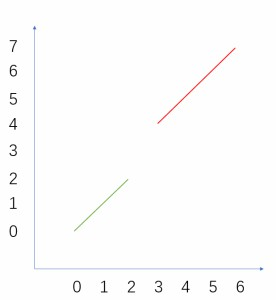

# 二分算法

## 算法介绍

二分算法是一种十分常见的算法, 常用于一个算法从O(N)的时间复杂度的搜索优化成O(logN)

## 算法思路

所谓的**二分算法**,就是我们知道**当前的候选区间**中,**一定存在**我们要找到的答案,而且我们发现这个区间拥有单调性质此类的性质,那么我们可以**不停地缩减候选**区间的范围,达到**排除无用答案**的效果.

二分的本质是**二段性**, 该性质留到最后的进阶部分进行剖析

二分算法的思路很简单, 但是代码不好实现, 细节过多. 这里作者给出俩个模板, 大家只要分析对应的场景, 加以应用即可

## 例题讲解

单纯的直接讲模板不好理解, 这里借助一道题来帮助大家理解

> 给定一个按照升序排列的整数数组 nums，和一个目标值 target。找出给定目标值在数组中的开始位置和结束位置。

```js
var nums = [5,7,7,8,8,10], target = 8;
function searchRange(nums, target) {/../}
searchRange(nums, target) // output: [3, 4]
```

这道题要求我们找到排序数组中, 让我们分别找到值为8的第一个位置和最后一个位置

1. 开始位置


我们可以观察值为8的开始位置, 发现其特点: 处于该位置左边(**不包含该位置**)的所有元素都严格小于8. 处于该位置右边(**包含该位置**)的所有元素都大于等于8. 也就是说, 我们根据该位置, 将该数组划分成了**俩个具有不同性质的区间**. (为了方便, 后续将<8的区间称为左区间, >=8的区间称为右区间)


初始的时候, 我们可以用l表示区间的左端点, r表示区间的右端点. l ~ r就表示target存在的区间

我们可以求出此时**候选区间**的中心点(mid), 判断处于中心点的值是处于哪个区间
- 若处于右区间, 证明nums[mid] >= 8, 我们令r = mid;
- 若处于左区间, 证明nums[mid] < 8, 我们令l = mid + 1; (l = mid + 1是因为nums[mid]不等于8, 所以mid左边(包括mid)一定不存在8)

这样不断的缩短候选区间, l = r的时候停止, 也就是区间长度为1的时候, 此时有俩种情况
- nums[l] == target, 区间存在这个数, 且找到该位置
- nums[l] != target, 区间不存在这个数

下面给出代码模板

```js
var l = 0, r = nums.length - 1;
while(l < r) {
    var mid = l + r >> 1; // 相当于 Math.floor((l + r) / 2)
    if(nums[mid] >= target) r = mid;
    else l = mid + 1;
}
// 最后的l = r, 所以判断nums[l] == target或者nums[r] == target都一样
```

2. 结束位置

与开始位置的判断类似, 我们可以发现: 处于该位置左边(**包含该位置**)的所有元素都小于等于8. 处于该位置右边(**不包含该位置**)的所有元素都大于8.


同样的我们默认l指向左端点, r指向右端点

我们可以求出此时**候选区间**的中心点(mid), 判断处于中心点的值是处于哪个区间
- 若处于右区间, 证明nums[mid] <= 8, 我们令l = mid;
- 若处于左区间, 证明nums[mid] > 8, 我们令r = mid - 1;

下面给出代码模板

```js
var l = 0, r = nums.length - 1;
while(l < r) {
    var mid = l + r + 1 >> 1; // 俩模板的不同点
    if(nums[mid] >= target) l = mid;
    else r = mid - 1;
}
```

可以发现, **俩模板不同的点就在于计算mid**时, 这是因为第一个模板需要向下取整, 而第二个模板需要向上取整的原因, 不然就会出现死循环/溢出的情况.

原题连接: [leetcode: 34. 在排序数组中查找元素的第一个和最后一个位置](https://leetcode-cn.com/problems/find-first-and-last-position-of-element-in-sorted-array/)

## 进阶

**二分搜索算法不仅可以用于排序数组**, 二分搜索的本质是二段性, 只要一个数在某一段区间中存在**二段性**, 那么我们就可以用二分算法将该数搜索出来.

见如下的一道题目

> 假设按照升序排序的数组在预先未知的某个点上进行了旋转。
> ( 例如，数组 [0,1,2,4,5,6,7] 可能变为 [4,5,6,7,0,1,2] )。
> 你可以假设数组中不存在重复的元素。
> 尝试使用O(logN)的时间复杂度求出原数组中第一个元素在旋转之后的下标

下面通过坐标图的方式来讲解二段性的含义(**x代表下标, y代表下标对应的数组的值**)

翻转前



翻转后


可以发现, 原数组的最后一个元素被旋转到了中间, 该位置左边所有点都大于等于旋转后数组的第一个元素, 该位置右边的所有点都严格小于旋转后数组的第一个元素. 我们可以称这个点满足了二段性, 所以可以用二分将该点搜索出来

代码如下:

```js
var l = 0, r = nums.length - 1;
while(l < r) {
    var mid = l + r >> 1;
    if(nums[mid] >= nums[0]) // 证明mid在目标位置的左边(包括当前位置)
        l = mid;
    else // 证明mid在目标位置的右边(不包括当前位置)
        r = mid - 1; 
}
```

通过求出最大元素在旋转后数组的位置就相当于求得原数组第一个元素的位置, 根据target和旋转后数组的第一个元素的大小比较就可以判断出target是存在于哪段排序区间, 确定区间后对该区间进行二分即可求得答案

原题连接: [leetcode: 33. 搜索旋转排序数组](https://leetcode-cn.com/problems/search-in-rotated-sorted-array/)