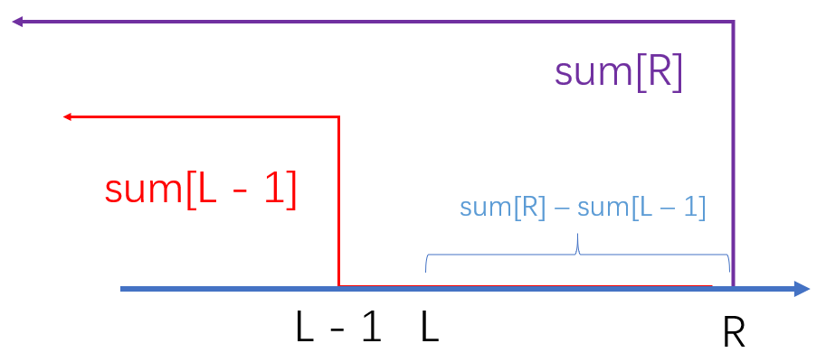

# 前缀和算法

开局一道题, 走进前缀和的世界: [leetcode: 1480. 一维数组的动态和](https://leetcode-cn.com/problems/running-sum-of-1d-array/)

本题的背景是leetcode第 193 场周赛的第一道热身题目

## 简单入门

题目给了我们一个数组, 要求我们求出该数组的前缀和, 假定sum表示的是最后的结果也就是前缀和数组, 我们将sum每一项的值列举出来

```
nums = [3,1,2,10,1]

sum[0] = nums[0] = 3
sum[1] = nums[0] + nums[1] = 3 + 1 = 4
sum[2] = nums[0] + nums[1] + nums[2] = 3 + 1 + 2 = 6
sum[3] = nums[0] + nums[1] + nums[2] + nums[3] = 3 + 1 + 2 + 10 = 16
sum[4] = nums[0] + nums[1] + nums[2] + nums[3] + nums[4] = 3 + 1 + 2 + 10 + 1 = 17

sum = [3, 4, 6, 16, 17]
```

所以说, 我们求sum[i]只需要对nums[0 ~ i]的数字求一个和. 代码如下

```js
var runningSum = function(nums) {
    const n = nums.length;
    const sum = Array.from({length: n}, () => 0);
    for(let i = 0; i < n; i ++)
        for(let j = 0; j <= i; j ++)
            sum[i] += nums[j];
    return sum;
};
```

这样的时间复杂度是O(n^2)的, 有没有更优秀的作法呢? 实际上是有的, 即是今天的主题, 前缀和算法

我们可以发现, 在计算sum[i]的时候, 除了nums[i], 其它的和已经在上一次(sum[i - 1])被计算过的, 我们可以直接使用上一次计算过的值. 

```
nums = [3,1,2,10,1]

sum[0] = nums[0] = 3
sum[1] = sum[0] + nums[1] = 3 + 1 = 4
sum[2] = sum[1] + nums[2] = 4 + 2 = 6
sum[3] = sum[2] + nums[3] = 6 + 10 = 16
sum[4] = sum[3] + nums[4] = 16 + 1 = 17

sum = [3, 4, 6, 16, 17]
```

如果上面这种方式你理解不了的话, 还有一种理解方式: 我们可以从定义出发, sum[i]表示的是前i个元素的总和, sum[i]是不是等同步前i - 1个元素的总和(sum[i - 1])加上第i个元素呢. 所以等式`sum[i] = sum[i - 1] + nums[i]`是成立的.

思路明白后, 我们就要实现代码, 在实现代码的过程中, 我们会发现一个边界问题: 当i等于0时, i - 1是 < 0的, 也就是会出现越界的情况. 所以我们要对边界情况进行特殊处理.

这里通常有俩种处理方式: 
1. 下标从1开始
2. 当i = 0的时候, 特判一下

本题使用第二种方案, 第一种方案会在后续提及

```js
var runningSum = function(nums) {
    const n = nums.length;
    const sum = Array.from({length: n}, () => 0);
    for(let i = 0; i < n; i ++)
        if(!i) sum[i] = nums[i];
        else sum[i] = sum[i - 1] + nums[i];
    return sum;
};
```

时间复杂度: O(n)

## 实际应用

但是前缀和算法究竟有什么实际的作用呢? 我们来看一下这道题目: [leetcode: 区域和检索 - 数组不可变](https://leetcode-cn.com/problems/range-sum-query-immutable/)

该题目给出一个数组, 要求我们计算出某一段区间的元素总和. 如若每给出一个区间我们做求和操作的话, 那在最坏情况下(假设每次都需要计算整个数组的和), 给出k次区间范围, 我们就得计算kn次. 能不能借助前缀和算法进行优化呢? 答案是可以的.

假设我们已经有了前缀和数组sum, 要求计算原数组nums区间(l, r)的元素和(我们用`sumRange`来代表它) 

```
sum[l] = nums[0] + nums[1] + ... + nums[l]
sum[r] = nums[0] + nums[1] + ... + nums[l] + ... + nums[r]

sumRange = nums[l] + ... + nums[r] = sum[r] - sum[l - 1]
```

图解:



通过这种方案, 每给出一个区间, 我们都可以在时间复杂度为O(1)的情况下得到答案. 给出k个区间的话, 时间复杂度就是O(k)的.

同样的, 在实现前缀和的时候, 我们需要对边界条件进行处理, 这次给出前缀和数组下标从0映射到从1开始的解决方案. 代码实现如下:

```js
var NumArray = function(nums) {
    const n = nums.length;
    this.prefix_sum = Array.from({length: n + 1}, () => 0);
    for(let i = 1; i <= n; i ++)
        this.prefix_sum[i] = this.prefix_sum[i - 1] + nums[i - 1];
};
NumArray.prototype.sumRange = function(i, j) {
    i ++, j ++; // 由于前缀和数组从1开始, 所以查找对应下标时都应该往后挪一位.
    return this.prefix_sum[j] - this.prefix_sum[i - 1];
};
```

```js

```

## 课后习题

### 扩展题

除了上面俩道题之外, 再多给一道二维平面前缀和的题目. 

[leetcode: 二维区域和检索 - 矩阵不可变](https://leetcode-cn.com/problems/range-sum-query-2d-immutable/)