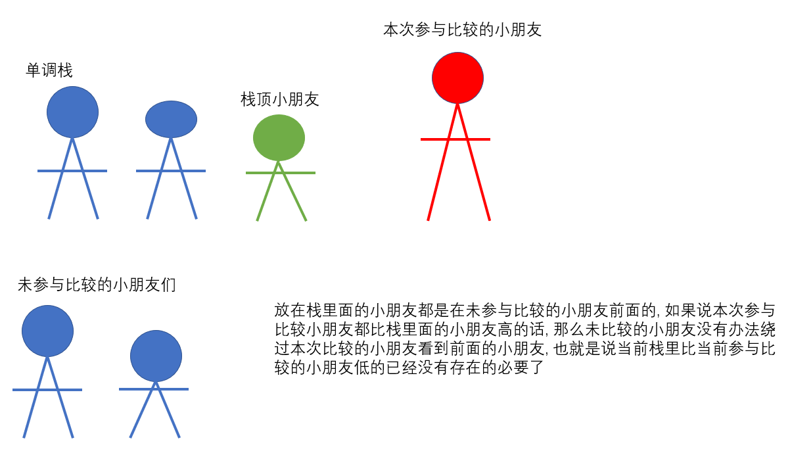

# 单调栈

温馨提示: 学习本章内容要求掌握**栈**这个数据结构的特点, 如果没有学习过栈这个数据结构的话希望可以先了解一下.

## 什么是单调栈

单调栈是一种特殊的栈, 在栈中的元素都具有一**单调性**(这个就和之前讲[双指针]()的内容十分类似了)

## 适用场景

单调栈这个数据结构应用场景其实十分局限, 但是却十分常考. 

它适用于这种场景: 要求某一个元素左/右边**第一个具有XXX性质**的元素, 如下:

> 给定一个nums数组, 要求我们给出对于一个元素而言, 右边第一个比它大的元素的下标. 若不存在返回-1

这题的实际场景就有点类似于小学举办演出的时候, 老师让一群小朋友排成一排有秩序的观看演出, 但是每个小朋友的位置是随机的. 那么就会出现前面一个小朋友太高挡到后面那个小朋友的情况. 后面那个小朋友向前看的时候就会看到前面第一个挡住它的那个脑袋. 现在我们来求一下如果小朋友被挡住的话, 那么它向前看时看到的那个脑袋是哪个小朋友的. 如果没有人挡住它的话, 那么为-1.

图解: 



```
input: nums = [3, 2, 6, 1, 1, 2]
output: [2, 2, -1, 5, 5, -1]
```

## 算法思路

我们可以一步步的读入小朋友的身高, 对于每一个小朋友, **判断栈里面哪些小朋友不会成为当前小朋友后面的小朋友们眼前的脑袋**. 于是, 我们可以将当前小朋友和栈顶(前面)的小朋友身高作比较, **如果它比栈顶的小朋友高的话, 那么在当前这个小朋友后面的小朋友们看到的肯定不会是当前处于栈顶的小朋友, 而会先看到当前的这个小朋友**, 也就是我们可以让栈顶小朋友出栈. **直到遇到比当前小朋友高的小朋友或者栈为空, 此时若栈不为空, 我们也可以确定谁会挡住当前小朋友**. 最后将当前小朋友加入到栈中.

## 代码实现

```js
Array.prototype.top = function() { // 返回数组的最后一个元素, 对于栈来说即返回栈顶元素.
    return this[this.length - 1];
}

function monotonousStack(nums) {
    const n = nums.length,
          stk = [],
          res = Array.from({length: n});
    for(let i = n - 1; i >= 0; i --) {
        while(stk.length && nums[i] >= nums[stk.top()]) stk.pop();
        if(stk.length) res[i] = stk.top();
        else res[i] = -1;
        stk.push(i);
    }
    return res;
}
```

## 写在最后

其实单调栈这个数据结构以及实现并不困难, 因为适用的场景就那么几个(开头已有给出). 这类问题的特点是思维难度偏高, 但代码容易实现, 故十分容易成为笔面试的考点. 对于某一道问题, 如果可以看出是单调栈的模型, 那么后面就是照搬代码了... 所以话说回来, 还是得多做点题目, 单调栈的题目有时候都会将考点隐藏起来, 不容易发现. 下一章就来分享一道实际的LeetCode例题, 看看单调栈是如何具体应用的. 